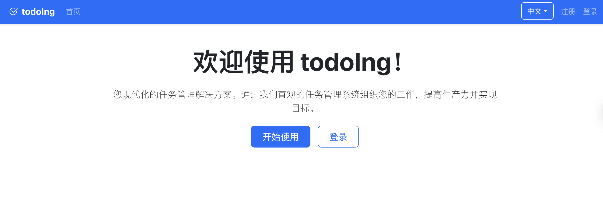

# todoIng - 任务管理系统

todoIng 是一个创新的任务管理系统，它不仅提供基本的任务管理功能，还为每个任务提供完整的生命周期追踪和变更历史记录，就像 Git 管理代码变更一样管理任务。

## 功能特性

- [x] 用户认证（注册/登录）
- [x] JWT令牌认证
- [x] 任务管理（创建、编辑、删除、状态变更）
- [x] 任务历史追踪（类似 Git 的任务变更历史）
- [x] 团队协作功能
- [x] 数据可视化展示
- [x] 多语言支持
- [x] 登录验证码功能（可选）
- [x] 注册控制功能（可选）
- [x] 报告生成功能（支持日报、周报、月报）
- [x] AI报告润色功能（集成OpenAI）
- [x] 任务日期验证（截止日期必须在计划日期之后）
- [x] 临近截止日期任务标记功能
- [x] 主页随机背景图片和GitHub统计信息展示
- [x] 邮箱验证码登录/注册功能
- [ ] 通知系统
- [x] Docker 容器化部署

## 技术栈

### 前端
- React 18
- TypeScript
- Redux Toolkit (状态管理)
- React Router v6 (路由管理)
- Bootstrap 5 (UI框架)
- Bootstrap Icons (图标库)
- i18next (国际化)
- Vite (构建工具)
- Axios (HTTP客户端)
- Marked (Markdown解析)

### 后端
- Node.js
- Express.js
- MongoDB (数据库)
- Mongoose (ODM)
- JSON Web Tokens (JWT认证)
- Bcrypt.js (密码加密)
- Speakeasy (双因素认证)
- QRCode (二维码生成)
- OpenAI (AI润色功能)
- Nodemailer (邮件发送)

## 配置管理

系统支持多种配置选项，可以通过环境变量进行控制：

| 变量名 | 描述 | 默认值 |
|--------|------|--------|
| `DISABLE_REGISTRATION` | 是否禁用注册功能 | `false` |
| `ENABLE_CAPTCHA` | 是否启用登录验证码 | `false` |
| `ENABLE_EMAIL_VERIFICATION` | 是否启用邮箱验证码功能 | `false` |
| `DEFAULT_USERNAME` | 默认用户名 | 无 |
| `DEFAULT_EMAIL` | 默认用户邮箱 | 无 |
| `OPENAI_API_KEY` | OpenAI API密钥，用于报告AI润色功能 | 无 |

更多配置信息请查看 [配置文档](./docs/configuration.md)。

## 快速开始

开发相关文档请查看 [docs/development](./docs/development) 目录：

- [开发计划](docs/development/development-plan.md)

## 文档

- [API 设计](./docs/api-design.md)
- [数据库设计](./docs/database-design.md)
- [实现计划](./docs/implementation-plan.md)
- [技术设计](./docs/technical-design.md)
- [UI/UX 设计](./docs/ui-ux-design.md)
- [配置管理](./docs/configuration.md)

## 项目截图



## 快速开始

### 使用 Docker Compose 部署（推荐）

```
# 克隆项目
git clone https://github.com/axfinn/todoIng.git
cd todoIng

# 启动服务
docker-compose up -d

# 访问应用
# 前端: http://localhost:81
# 后端 API: http://localhost:5001/api
```

### 使用 Docker Hub 镜像

```
# 拉取镜像
docker pull axiu/todoing:latest
docker pull axiu/todoing-frontend:latest

# 运行服务
docker-compose -f docker-compose.local.yml up -d
```

#### 开发环境部署
```
# 克隆项目
git clone <repository-url>
cd todoIng

# 构建并启动开发环境
docker-compose -f docker-compose.dev.yml up -d

# 应用将在以下地址可用：
# 前端: http://localhost:3000
# 后端API: http://localhost:5001
```

### 功能说明

#### 登录验证码功能
系统支持可选的登录验证码功能，以增强安全性。当 `ENABLE_CAPTCHA=true`（后端）和 `VITE_ENABLE_CAPTCHA=true`（前端）时，登录界面会显示验证码输入框和获取验证码按钮。

用户需要先点击"获取验证码"按钮，然后输入显示的验证码进行登录。

#### 注册控制功能
系统支持通过环境变量控制是否允许新用户注册。当 `DISABLE_REGISTRATION=true` 时，注册接口将被禁用，新用户无法通过常规注册流程创建账户。

#### 邮箱验证码功能
系统支持邮箱验证码登录和注册功能，提供更灵活的认证方式：

1. **注册时邮箱验证码**：
   - 用户在注册时需要提供邮箱地址并获取验证码
   - 输入收到的验证码完成注册流程
   - 可与图片验证码同时使用以增强安全性

2. **登录时邮箱验证码**：
   - 用户可以选择使用邮箱验证码登录而无需密码
   - 点击"邮箱验证码登录"切换登录方式
   - 获取并输入验证码即可登录

要启用邮箱验证码功能，需要设置以下环境变量：
- 后端：`ENABLE_EMAIL_VERIFICATION=true`
- 前端：`VITE_ENABLE_EMAIL_VERIFICATION=true`
- 邮件服务器配置（`EMAIL_HOST`, `EMAIL_PORT`, `EMAIL_USER`, `EMAIL_PASS`等）

### 方法二：手动部署

#### 后端设置
```
# 进入后端目录
cd backend

# 安装依赖
npm install

# 创建.env文件并配置环境变量
cp .env.example .env
# 编辑.env文件，设置MONGO_URI和JWT_SECRET

# 启动后端服务
npm start
# 或者开发模式
npm run dev
```

#### 前端设置
```
# 进入前端目录
cd frontend

# 安装依赖
npm install

# 创建.env文件并配置环境变量
cp .env.example .env
# 编辑.env文件，设置VITE_API_URL

# 启动前端开发服务器
npm run dev

# 或者构建生产版本
npm run build
```

## 部署

应用支持多种部署方式：
1. Docker 容器化部署
2. 传统部署方式

详细部署说明请参考 [部署文档](./docs/deployment.md)。

## Docker 自动构建

本项目使用 GitHub Actions 实现 Docker 镜像的自动构建和推送。每当有新的 Git 标签创建时，GitHub Actions 会自动构建 Docker 镜像并推送到 Docker Hub。

### 配置自动构建

要为你的 fork 配置自动构建，需要在 GitHub 仓库中设置以下 Secrets:

1. `DOCKERHUB_USERNAME` - 你的 Docker Hub 用户名
2. `DOCKERHUB_TOKEN` - 你的 Docker Hub 访问令牌

生成 Docker Hub 访问令牌的步骤:
1. 登录到 [Docker Hub](https://hub.docker.com/)
2. 进入 Account Settings（账户设置）
3. 点击 Security（安全）选项卡
4. 点击 "New Access Token"（新建访问令牌）
5. 为令牌添加描述（例如："GitHub Actions"）
6. 选择适当的权限（通常选择 Read & Write）
7. 点击 "Generate"（生成）
8. 复制生成的令牌并将其作为 `DOCKERHUB_TOKEN` Secret 添加到 GitHub

## 版本更新日志

### v1.8.6 (2025-08-05)
- 新增邮箱验证码注册功能
- 新增邮箱验证码登录功能
- 改进注册页面用户体验，支持仅使用邮箱验证码注册
- 改进登录页面用户体验，支持切换密码登录和邮箱验证码登录
- 优化验证码处理逻辑，邮箱验证码登录时不需要图片验证码
- 修复注册和登录接口验证逻辑问题

### v1.8.5 (2025-08-03)
- 修复语言切换功能无反应问题
- 修复语言切换下拉菜单显示问题
- 更新文档和添加收款码信息

(历史版本信息省略)

## 请作者喝咖啡

如果你觉得这个项目对你有帮助，欢迎请作者喝杯咖啡！

<div style="display: flex; gap: 20px;">
  <div>
    <h4>支付宝</h4>
    
  </div>
  <div>
    <h4>微信支付</h4>
    
  </div>
</div>

## 贡献

欢迎提交 Issue 和 Pull Request 来帮助改进项目。

## 许可证

[MIT](./LICENSE)